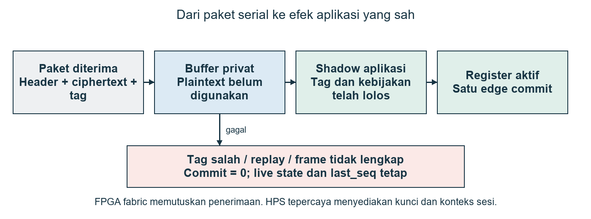
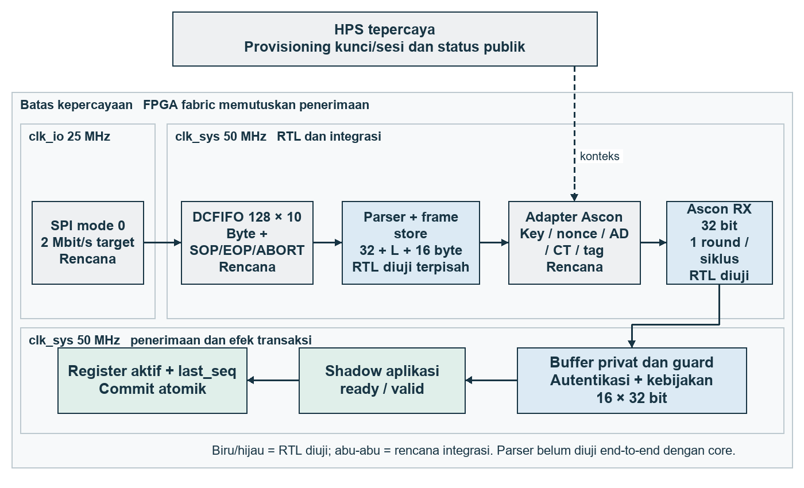

# SENTINEL

**IP penerima serial aman berbasis Ascon-AEAD128 dengan verifikasi paket, proteksi replay, dan commit atomik.**

Tim TRINITY LFA, Telkom University. PERURI Chip Hackathon 2026, kategori IC Chip Design & FPGA Implementation, area Secure Communication.

SENTINEL menahan plaintext sampai tag dan kebijakan paket lolos. Data yang disetujui masuk ke shadow aplikasi; register aktif dan `last_seq` berubah bersama pada satu edge commit. Demo awal adalah konfigurasi register/LED untuk kendali IoT. HPS dipercaya untuk provisioning; keputusan penerimaan berada di FPGA fabric.



## Mulai dari sini

Linux atau WSL: Python 3.9+, GCC/G++, Make dan Verilator. Pengujian lokal terbaru memakai **Verilator 5.048**; snapshot lama memakai 5.020.

```bash
git clone https://github.com/Fijarsatria/SENTINEL.git
cd SENTINEL
make snapshot    # periksa bukti yang dikirim tanpa simulator
make demo        # tampilkan tiga kasus demonstrasi
make verify      # kompilasi dan jalankan semua suite RTL
make mutations   # pastikan dua bug sengaja ditangkap assertion
```

Pada Ubuntu/WSL, prasyarat dapat dipasang dengan `sudo apt-get install verilator build-essential python3`. Panduan lengkap, definisi sinyal dan batas bukti: [verifikasi](docs/verification.md), [keamanan](docs/security.md), [board](docs/board-integration.md).

## Hasil yang telah dijalankan

| Suite | Kasus | Bukti |
|---|---:|---|
| Core Ascon RX, guard dan aplikasi | 10.697 | 1.089 KAT; 7.936 mutasi satu bit; 1.536 paket sah utama; 136 kasus lain; 1.593 commit sesuai harapan |
| Parser byte/token | 10.290 | 1.314 frame diterima; 8.976 frame ditolak/dibatalkan atau direset |
| Kontrak antarmuka guard | 7 | Beat akhir bersamaan dengan autentikasi, packing, beat tidak sah, overflow panjang, dan watchdog |
| Dua mutasi implementasi | 2 | Assertion menangkap bypass autentikasi dan bypass replay; dua kegagalan yang diharapkan |

Suite parser dan kriptografi berjalan **terpisah**. Penjumlahan kasus tidak menyatakan pengujian serial end-to-end. Demo 3 kasus adalah subset suite core. KAT menonaktifkan guard protokol. Mutasi bit menggunakan sembilan transaksi dasar berukuran 1/15/16/17/31/32/33/63/64 byte, bukan seluruh ruang input. Semua angka berasal dari CSV dan log di [evidence](evidence/).

Pada 1.024 payload acak 64 byte tanpa stall, start core ke commit adalah median/p99 **140 siklus = 2,80 µs**, dengan clock simulasi 20 ns. Start core ke hasil autentikasi adalah 124 siklus = 2,48 µs. Angka tersebut tidak mencakup SPI, CDC, fitting atau board.

## Status modul

| Modul | Status |
|---|---|
| Core vendor, buffer privat, guard, shadow/commit aplikasi | RTL disimulasikan bersama dan dipantau setiap siklus |
| `rtl/sentinel_frame_parser.sv` | RTL diuji terpisah; descriptor dibekukan sampai diterima consumer |
| SPI sampler, CDC FIFO dan adapter parser-ke-core | Spesifikasi integrasi; belum RTL board yang diuji |
| MMIO, provisioning kunci, reset dua domain | Spesifikasi; belum diimplementasikan |
| Quartus, TimeQuest, bitstream, ALM/M10K, daya, board | Belum diukur; batas resource dan latensi serial adalah target |



## Navigasi

- [Arsitektur dan format paket](docs/architecture.md)
- [Threat model dan sifat keamanan](docs/security.md)
- [Hasil, pengujian dan cara reproduksi](docs/verification.md)
- [Integrasi DE10-Nano](docs/board-integration.md)
- [Skenario demo 3–5 menit](docs/demo.md)
- [Pembagian peran dan bootcamp](docs/bootcamp.md)
- [Ketentuan PERURI](docs/peruri-compliance.md)
- [Riset dan keputusan desain](docs/research.md)
- [Audit dan perubahan](docs/review.md)
- [Diagram draw.io yang dapat diedit](diagrams/SENTINEL_Design.drawio)

## Kontribusi dan hak penggunaan

Kontribusi tim adalah wrapper transaksi, penerimaan aman, parser, validasi dan bukti efek aplikasi. Ascon, FIFO CDC dan counter bukan algoritma baru. Hak kode asli tetap mengikuti [ORIGINAL_CODE_NOTICE.txt](ORIGINAL_CODE_NOTICE.txt); lisensi umum penggunaan ulang belum diberikan. Vendor Ascon RTL dan C/KAT mempertahankan CC0-1.0. Lihat [atribusi](THIRD_PARTY_NOTICES.md). Tidak ada klaim sertifikasi kriptografi, formal proof, ketahanan fault fisik, atau produk siap produksi.
