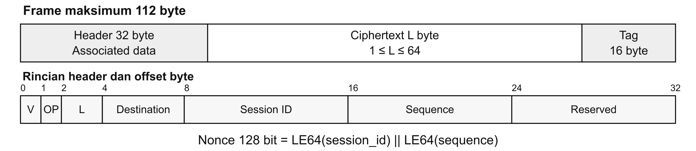
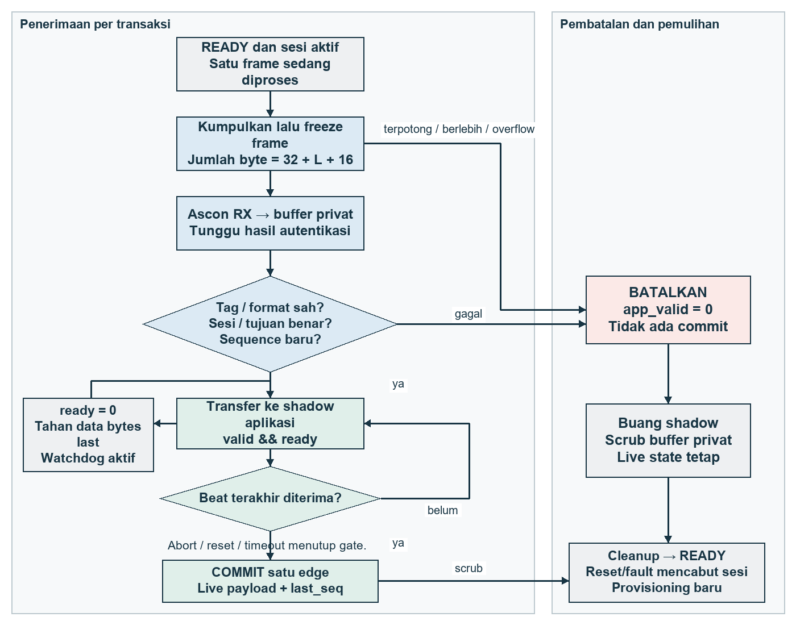

# Architecture and protocol

SENTINEL is a proposed fixed-function RX IP on the FPGA fabric of a DE10-Nano Cyclone V SoC. HPS and FPGA fabric are parts of the same SoC. The trusted HPS stages a session key and context, then reads public status; it does not make packet-acceptance decisions or write live application payloads.

## Frame

SPI mode 0, target maximum 2 Mbit/s. The sender waits for READY before starting a frame. Only one frame is in flight. Header (32 bytes) + ciphertext (L bytes) + tag (16 bytes), where 1 <= L <= 64.

| Offset | Bytes | Field | Rule |
|---:|---:|---|---|
| 0 | 1 | version | 1 |
| 1 | 1 | opcode | 1: 4-byte configuration; 2: data |
| 2 | 2 | L | 1..64; opcode 1 requires L=4 |
| 4 | 4 | destination | Matches provisioned destination |
| 8 | 8 | session_id | Matches active session |
| 16 | 8 | sequence | Strictly greater than last_seq |
| 24 | 8 | reserved | Zero |

Header fields are serialized little-endian. The complete header is authenticated as associated data. Nonce = LE64(session_id) || LE64(sequence); key, nonce and tag are each 128 bits. The sender never repeats a nonce under a key. Counter wrap is prohibited. Reset requires a fresh key/session before service resumes.

## Receive sequence

1. Sampler emits byte/token entries to the 128x10 dual-clock FIFO. The proposed 2-bit type is DATA, SOP, EOP or ABORT; the other 8 bits carry a byte.
2. Parser accepts exactly 32+L+16 bytes, freezes the descriptor and frame, and prevents overwrite while busy.
3. Ascon adapter feeds key/nonce/AD/ciphertext/tag with the vendor ready/valid and end-of-type contract. Plaintext words only enter the private 64-byte quarantine.
4. Guard checks authentication, complete byte count, version/opcode/length, active session/destination and sequence. A two-bit approval token becomes `10` only after acceptance.
5. Approved words transfer to application shadow with ready/valid. During a stall, data, byte count and last indication stay stable. The last accepted word produces `app_commit`.
6. One edge updates live application state and last_seq. Rejects do not advance last_seq. Private/shadow state is scrubbed before another frame.

The existing guard uses a 5-bit one-hot phase register: LOCKED, IDLE, COLLECT, RELEASE, SCRUB. An illegal phase or approval token revokes the session and enters scrubbing. One-bit FSM/token injections were tested; this does not establish resistance to physical fault attacks.

## Storage

| Store | Logical data | Proposed implementation |
|---|---:|---|
| CDC FIFO | 128x10 = 1280 bits | Vendor DCFIFO on board |
| Frame | 112x8 = 896 bits maximum | Private frame RAM, rounded/packed by fitter |
| Plaintext quarantine | 64x8 = 512 bits | 16x32 array in tested RTL; RAM inference not claimed |
| Application shadow | 64x8 = 512 bits | Registers in tested RTL, supports atomic copy |
| Live application payload | 512 bits | Application registers, counted separately |

The first four stores total 3200 logical bits. This is not physical M10K consumption. Core state, key/context registers, packing and port requirements are additional. The initial integration budget is <=6000 ALM, <=5000 registers, <=6 M10K, 0 DSP, and at most 1 FPGA PLL. No fitting result is reported.

## Updated implementation and timing contract

`rtl/sentinel_frame_parser.sv` now implements the byte/token stage and private frame storage in one clock domain. It freezes header/ciphertext/tag until the consumer accepts the descriptor. It checks exact size and handles truncation, excess bytes, invalid length, ABORT, overflow and timeout. 10,290 parser cases were run independently of the core suite; this is not integrated serial evidence.

Guard input beats must be packed: intermediate words carry four bytes, and only the last word may carry one to three bytes. The final plaintext word may coincide with `auth_valid`; the acceptance count includes that word. Guard and parser each default to a 100,000-cycle watchdog. At a hypothetical fitted 50 MHz this is 2 ms per stage; the faster timeout settings used in tests are recorded in the testbenches. Commit is suppressed on the timeout edge. Adapter, SPI/CDC and the joint reset controller remain integration work.
